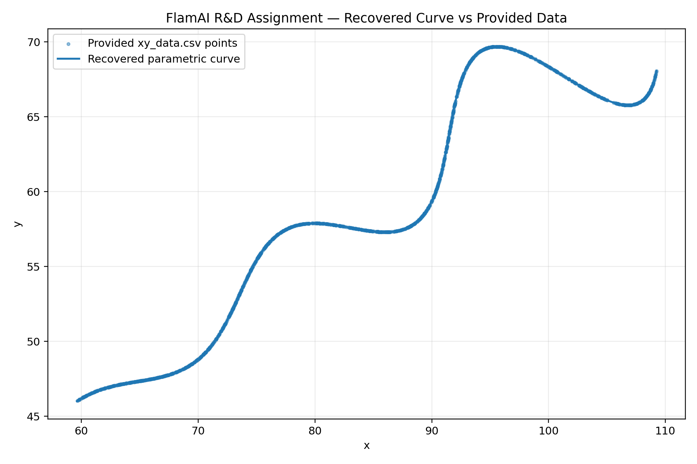

# FlamAI R&D Assignment — Parametric Curve Parameter Recovery

**Candidate:** K Prakhar Narayan  
**Role:** Software Development Engineer Intern (R&D)

## Final Answer

The recovered unknown parameters are:

- **theta = 0.5235983 radians** (approximately **29.999973 degrees**, i.e. approximately 30 degrees)
- **M = 0.03**
- **X = 55**

The final curve used for submission is:

```text
\left(
t\cos(0.5235983)-e^{0.03\left|t\right|}\sin(0.3t)\sin(0.5235983)+55,\;
42+t\sin(0.5235983)+e^{0.03\left|t\right|}\sin(0.3t)\cos(0.5235983)
\right)\left\{6<t<60\right\}
```

## 1. Problem

The supplied points are generated by the parametric curve

$$
x=t\cos(\theta)-e^{M|t|}\sin(0.3t)\sin(\theta)+X
$$

$$
y=42+t\sin(\theta)+e^{M|t|}\sin(0.3t)\cos(\theta)
$$

with the constraints

$$
0^\circ<\theta<50^\circ,\qquad -0.05<M<0.05,\qquad 0<X<100
$$

and

$$
6<t<60.
$$

The supplied `xy_data.csv` contains **1500 points**.

## 2. Key Mathematical Observation

Define

$$
a=e^{M|t|}\sin(0.3t).
$$

Then the model can be written as

$$
x-X=t\cos\theta-a\sin\theta
$$

$$
y-42=t\sin\theta+a\cos\theta.
$$

This is a 2D rotation:

```math
\begin{bmatrix}
x-X\\
y-42
\end{bmatrix}
=
\begin{bmatrix}
\cos\theta & -\sin\theta\\
\sin\theta & \cos\theta
\end{bmatrix}
\begin{bmatrix}
t\\
a
\end{bmatrix}
```

Applying the inverse rotation gives

```math
t=(x-X)\cos\theta+(y-42)\sin\theta
```

and

```math
a=-(x-X)\sin\theta+(y-42)\cos\theta.
```

For the correct parameters, every supplied point must therefore satisfy

```math
-(x-X)\sin\theta+(y-42)\cos\theta
=
e^{M|t|}\sin(0.3t)
```

where

```math
t=(x-X)\cos\theta+(y-42)\sin\theta.
```

This converts the original problem into a small **three-parameter numerical optimisation problem**.

Because the assignment states `6 < t < 60`, all valid `t` values are positive, so `|t| = t` on the required interval. The code keeps `abs(t)` anyway so it matches the original equation exactly.

## 3. Optimisation Method

I used two stages:

1. **Differential Evolution**
   - Searches globally inside the exact parameter bounds.
   - Minimises the mean absolute model-consistency residual.
   - Adds a strong penalty when inferred `t` values leave the required interval.

2. **Non-linear Least-Squares Refinement**
   - Starts from the global optimum.
   - Refines the parameters to high numerical precision.

The raw numerical fit obtained from the supplied data is approximately:

| Parameter | Raw fitted value |
|---|---:|
| theta (radians) | 0.523598303175 |
| theta (degrees) | 29.9999729322 |
| M | 0.0299999968731 |
| X | 54.9999982128 |

These values clearly recover the generating parameters:

$$
\boxed{\theta=0.5235983,\quad M=0.03,\quad X=55}
$$

The tiny difference between the raw fit and the rounded values is at floating-point/data precision level.

## 4. Validation

Using the recovered rounded parameters on the supplied data:

- Mean absolute model-consistency residual: **2.724699414370e-06**
- RMSE residual: **3.742511204099e-06**
- Maximum absolute residual: **1.641854418688e-05**

The validation plot below overlays the supplied 1500 points and the recovered curve.



## 5. Final Parametric Curve

$$
\boxed{
x=t\cos(0.5235983)
-e^{0.03|t|}\sin(0.3t)\sin(0.5235983)+55
}
$$

$$
\boxed{
y=42+t\sin(0.5235983)
+e^{0.03|t|}\sin(0.3t)\cos(0.5235983)
}
$$

for

$$
6<t<60.
$$

## 6. Reproduce the Result

Install dependencies:

```bash
python -m pip install -r requirements.txt
```

Run:

```bash
python solve.py
```

The script reads `xy_data.csv`, performs the global search, refines the result, and prints the recovered parameters and validation errors.

## 7. Files

```text
.
├── README.md
├── solve.py
├── requirements.txt
├── xy_data.csv
├── DESMOS_EQUATION.txt
├── .gitignore
└── results/
    └── fitted_curve.png
```

## 8. Desmos

Paste the expression from `DESMOS_EQUATION.txt` into the Desmos calculator and save/share the graph.

The required expression is:

```text
\left(
t\cos(0.5235983)-e^{0.03\left|t\right|}\sin(0.3t)\sin(0.5235983)+55,\;
42+t\sin(0.5235983)+e^{0.03\left|t\right|}\sin(0.3t)\cos(0.5235983)
\right)\left\{6<t<60\right\}
```
